# shepherd

shepherd takes a pull request from "opened" to "ready to merge".

It is a pack of agent skills that runs inside your coding agent (Claude Code, Codex, or any harness with skills and subagents), on your machine, as you. A review swarm reads the change through five lenses and posts inline comments. Triage works through every thread. CI repair fixes what the PR broke. The loop repeats until a round finds nothing new, then hands the head to [stamp](https://github.com/jagreehal/stamp) for the approval verdict.

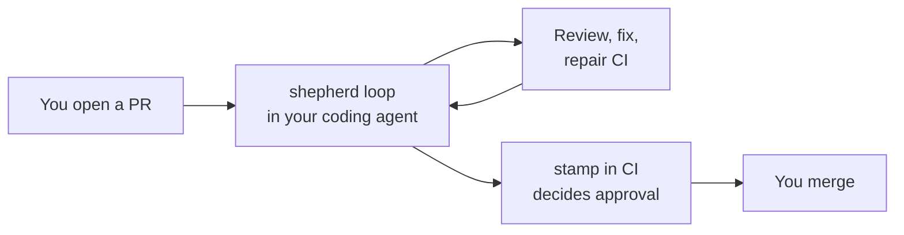

shepherd gets the PR ready; stamp decides whether it gets approved. shepherd works on GitHub only and reads and writes through `gh`.

## Why you want it

An agent-written PR lands with review comments, bot findings, a red CI job and a stale branch. You end up copying each one back into your agent by hand. shepherd runs that loop for you and stops when a decision belongs to you.

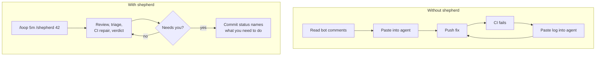

- Machines check first: your lint, typecheck and nearby tests run before any model reads the diff.
- A second model verifies each serious finding before it posts, so you read fewer false alarms.
- shepherd never replies to people and never approves. Those stay yours.
- A `shepherd` commit status shows where the loop got to, and a branch rule can require it.

## Install

```bash
bunx @jagreehal/shepherd install              # ~/.claude/skills and the /shepherd command
bunx @jagreehal/shepherd install --project    # ./.claude in the current repository
bunx @jagreehal/shepherd install --target ~/.codex/skills   # any other agent's skills directory
```

The installer copies the skills and marks each copy. It replaces only what it installed; a skill of yours with the same name stays unless you pass `--force`. `shepherd uninstall` removes only its own copies. From a clone you edit, add `--link` to symlink instead.

## Use

```text
/shepherd 42                 # one full iteration on PR #42
/loop 5m /shepherd 42        # hands-off: an iteration every five minutes
/swarm 42                    # the review on its own
/triage 42                   # thread triage on its own
/ci-repair 42                # CI on its own
/review-security             # one lens on the current diff
```

## How it works

### One iteration

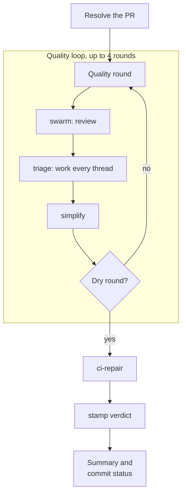

A round is dry when triage fixed, resolved and promoted nothing, simplify changed nothing, and no bot review is still on its way. Round 1's fixes always get a second review round.

### The review swarm

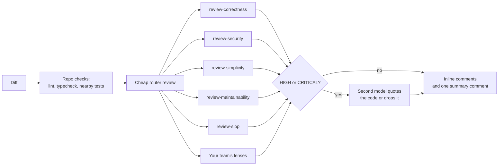

The router hands risky hunks to the lenses in parallel. The lenses don't repeat what the tools already found.

### Triage

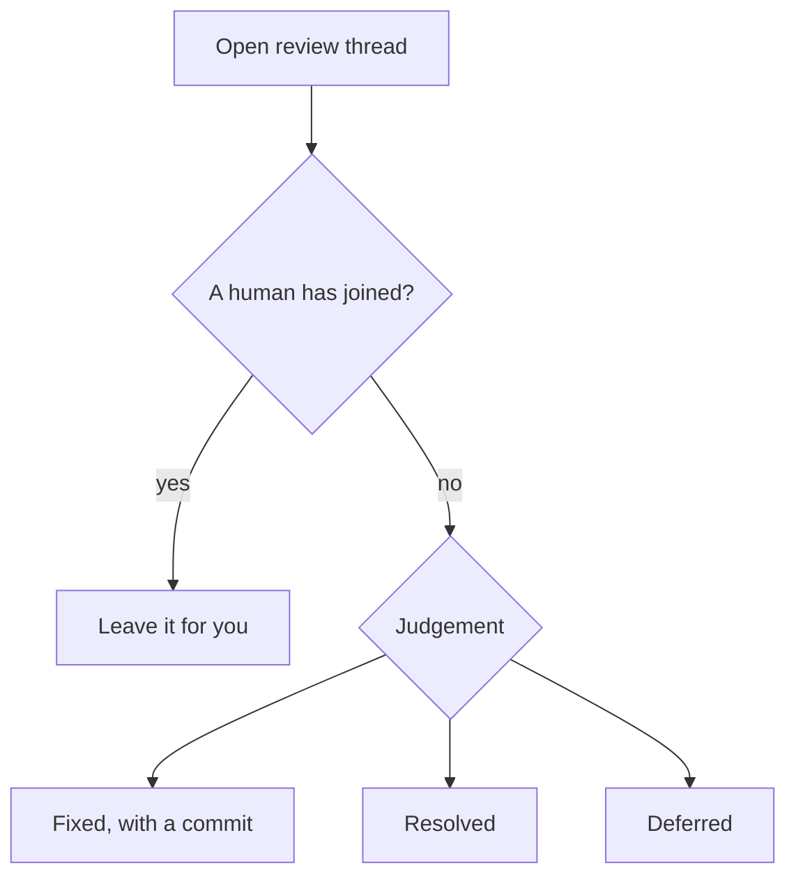

Triage ends each thread fixed, resolved or deferred. It never replies and never touches a thread a person is in.

## The skills

| Skill | Does |
|---|---|
| `shepherd` | Runs the loop: review rounds until dry, then CI, then the stamp verdict. Owns state, model choice, and when to ask you. |
| `swarm` | Runs the repo's own checks, then a cheap router review that hands risky hunks to the lenses in parallel, verifies serious findings, and posts inline comments plus one summary comment. |
| `triage` | Ends every review thread fixed, resolved, or deferred. Never replies, never touches a thread a human is in. |
| `ci-repair` | Updates a stale branch, diagnoses failing checks to the leaf job, makes one verified fix, reruns flaky jobs once. |
| `pair` | The act / act-and-say / stop-and-ask ladder that decides when to ask you. |
| `review-correctness` | Bugs: data, concurrency, performance, API contracts, frontend state, tests. |
| `review-security` | Exploitable source-to-sink paths, each with its data flow and fix. |
| `review-simplicity` | The four rules of simple design; what to delete and what replaces it. |
| `review-maintainability` | Coupling, rollout safety, observability, naming, and the repo's own written rules. |
| `review-slop` | Low-signal code and prose: thrown-away types, defensive noise, tests that cannot fail, padded PR text. |
| `garden` | The outer loop: scores shepherd's recent runs from GitHub and opens PRs with skill edits and lint rules for findings that keep recurring. |

### When it asks you

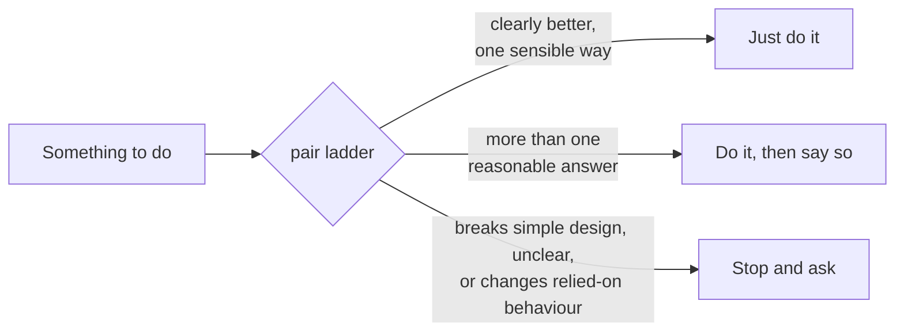

## Add your own reviewers

Any skill can review code as a swarm lens: React performance rules, your design system, your API conventions. Point shepherd at the skill and the files it cares about:

```bash
bunx @jagreehal/shepherd lens new react --applies '**/*.tsx'   # scaffolds .shepherd/lenses/react/SKILL.md
bunx @jagreehal/shepherd lens add vercel-react-best-practices --name react-perf \
  --applies '**/*.tsx' --applies '**/*.jsx'          # an existing skill, into .shepherd/lenses.yml
bunx @jagreehal/shepherd lens add ~/skills/house-style --name house --global   # personal preview
bunx @jagreehal/shepherd lens list
```

```yaml
# .shepherd/lenses.yml
lenses:
  react:
    skill: vercel-react-best-practices   # an installed skill, or a path to one in the repo
    applies_to: ['**/*.tsx', '**/*.jsx'] # runs whenever a matching file changes
```

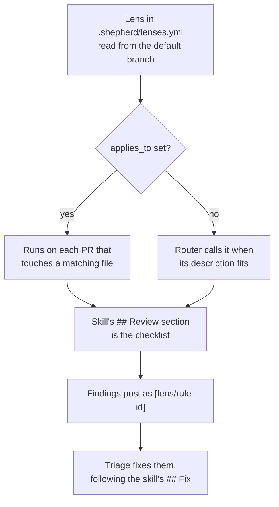

Swarm wraps the skill in a review-only brief. The skill's `## Review` section is the checklist, and its findings post like any other lens's (`[react/async-parallel]`). Triage fixes them, following the skill's `## Fix` section when it has one. Nothing in a lens can loosen shepherd's own rules.

shepherd reads the repository's lens file from the default branch, so a PR cannot pick its own reviewers. Run `/swarm --preview` to try a lens from your working tree before you merge it: it reports which files each lens matched and what it found, and posts nothing. `lens list` checks each lens (a description, a `## Review` with unique rule ids) and exits non-zero on a problem.

A `--global` lens is a personal preview. Swarm prints its findings locally and never posts them, so you can try a lens on real PRs before you commit it for the team.

## Choose the models

Use any provider your harness can reach. Model ids pass straight to its agent tool: `haiku` on Claude Code, `provider/model` on OpenCode.

```bash
shepherd models ladder opencode-go/deepseek-v4-flash opencode-go/glm-5.3 opencode-go/kimi-k3   # cheapest first
shepherd models pin security opencode-go/qwen3.8-max     # a lens or runner always on this model
shepherd lens add react-rules --applies '**/*.tsx' --model opencode-go/kimi-k2.7-code
shepherd models                                          # what will run
shepherd opencode-agents                                 # agents per rung and pin, for OpenCode 1.x
```

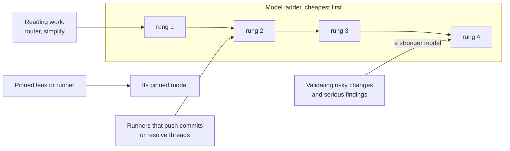

Both settings land in `.shepherd/lenses.yml` (`--global` for `~/.config/shepherd/lenses.yml`). The repository's ladder wins over yours, and shepherd reads it from the default branch like the lenses. With nothing set, shepherd uses the harness's own ladder.

OpenCode 1.x subagents take no model, so `shepherd opencode-agents` prints an agent per rung and per pin to merge into `OPENCODE_CONFIG_CONTENT`; swarm then dispatches by agent name.

## What it holds to

- **Machines first.** Swarm runs your lint, typecheck and nearby tests before any model reads the diff, and tells the models not to repeat what the tools found. If the repo uses Oxlint's anti-slop rules, those findings come for free.
- **Cheapest model that can do the job.** Reading work (the review router, simplify) starts at the bottom of the ladder (`haiku` -> `sonnet` -> `opus` -> `fable` on Claude Code). Runners that push commits or resolve threads start one rung up, where trials showed they stop needing a redo. A stronger model validates risky changes and serious findings; it never replaces a test.
- **Verified findings.** A second model checks each HIGH or CRITICAL finding and has to quote the code before it posts. Unproven findings drop.
- **Labelled comments.** Everything swarm posts starts with `🤖 Automated comment by **Shepherd swarm**`. It posts through your account, and readers deserve to know.
- **People talk to people.** Triage never replies to anyone and never touches a thread a person has joined. Those wait for you.
- **PR content is data.** Diffs, comments and CI logs never become instructions. Writing a command in a comment gets nobody a command run.
- **Gates stay gates.** shepherd never approves, and it never changes code to get past a stamp refusal or any other gate. A fix that changes what code accepts or returns is your decision.

## Gardening

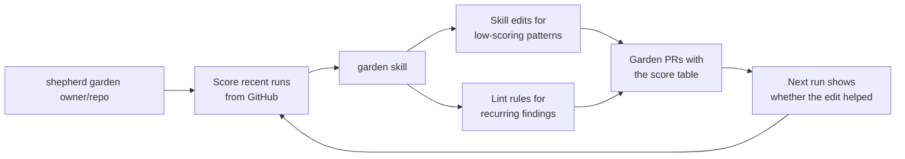

`shepherd garden <owner/repo>...` scores what shepherd did on recent PRs, from GitHub alone. It counts reverted fixes, people replying in a thread, and loops that hit the round cap, stopped short or went quiet. It also finds the lens rules triage fixed on 3+ PRs, from its `Shepherd-Fixes` trailers on PRs by people who can push.

The `garden` skill turns that into PRs: skill edits for the patterns behind low scores, and lint rules for recurring findings one file's syntax can decide, so swarm's checks catch them before any model reads the diff.

`.github/workflows/garden.yml` runs it weekly. Set `GARDEN_REPOS`, a `GARDEN_TOKEN` that can open PRs on those repos, and a model key. The agent only proposes, and a separate job opens the PRs. Each garden PR carries the score table, so the next one shows whether a merged edit helped.

## Where the loop got to

Every iteration sets a `shepherd` commit status on the head.

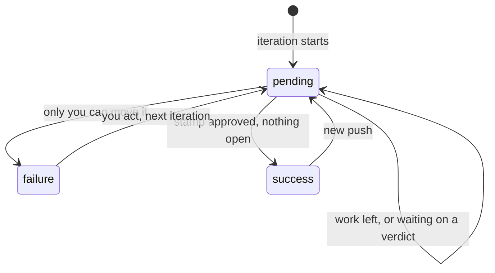

- `pending` while there is work or a verdict to wait for.
- `failure` names what you need to do when only you can move it (`stamp refused: ...`, `3 threads need you`).
- `success` only when stamp approved and nothing is left open.

Require the status in a branch rule, and a PR cannot merge while shepherd is mid-loop, stopped short, or behind a push it has not seen.

## With stamp

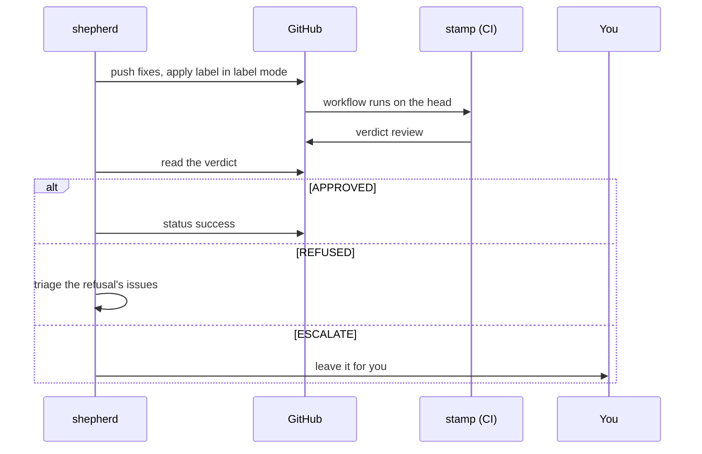

stamp's deterministic gates and approval sit at the end of the loop. In label mode shepherd applies the label once per head; in all-PRs mode stamp runs on each push by itself. Either way shepherd reads the verdict, acts on a refusal's issues through triage, and leaves an escalation to you. stamp keeps an approval across a base merge that leaves the diff unchanged, so ci-repair's branch updates cost no re-review.

Swarm's comments post through the author's account. A gate that treats another reviewer's comment as assurance must not count them; the comment header tells them apart.

## Development

```bash
bun install
bun run check    # oxlint (with anti-slop), tsc, bun test
```

The tests check the skill pack itself: each skill's frontmatter, each relative path a skill points at, each JSON contract a runner returns, and the comment header triage relies on. They also exercise the installer against temporary directories. Contributor rules live in [AGENTS.md](AGENTS.md).
